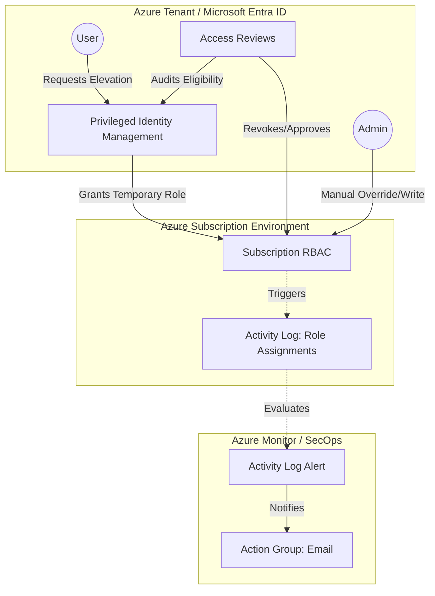

---

[](https://github.com/sammyonyekwere/Identity-Governance-Automation/actions/workflows/deploy.yml)
[](https://opensource.org/licenses/MIT)
[](https://learn.microsoft.com/en-us/azure/azure-resource-manager/bicep/)

> **Portfolio Project**: A production-ready reference implementation of Identity Governance operations in Microsoft Azure, demonstrating Infrastructure as Code (IaC), Privileged Identity Management (PIM), and Access Reviews.

## 📖 Executive Summary
This repository demonstrates an automated, secure Identity Governance lifecycle adhering to the principles of **Least Privilege** and **Zero Trust**.

Unlike manual role assignments, this project focuses on **dynamic governance**, utilizing Azure AD Privileged Identity Management (PIM) for temporal eligibility, enforcing compliance via Access Reviews, and monitoring for privilege escalations through Azure Monitor Activity Log Alerts.

## 🏗️ Architecture


## 🛠️ Technology Stack
*   **Infrastructure as Code**: Azure Bicep (Modularized design)
*   **Identity & Governance**:
    *   Microsoft Entra ID (Azure AD)
    *   Privileged Identity Management (PIM)
    *   Access Reviews
*   **Monitoring & SecOps**:
    *   Azure Monitor (Activity Log Alerts)
    *   Azure Action Groups (Email Notifications)

## 📂 Repository Structure
This project follows modular infrastructure practices:

```text
/
├── modules/             # Reusable Bicep modules
│   ├── rbac-pim.bicep       # Sets up Contributor eligibility via PIM
│   ├── access-reviews.bicep # Creates quarterly attestation reviews
│   └── alerts.bicep         # Provisions privilege escalation alerts
├── main.bicep           # Orchestrator for subscription deployment
└── README.md            # System documentation
```

### 1. Privileged Identity Management (PIM)
*   **Temporary Elevation**: Standard, permanent role assignments (like Contributor) are shifted to "Eligible" assignments requiring deliberate, time-bound activation.
*   **Least Privilege Enforcement**: By default, the eligibility lasts for 1 year and allows the user to assume the role only when needed.

### 2. Automated Access Reviews
*   **Attestation**: Initiates a recurring Azure AD Access Review Schedule (Quarterly).
*   **Justification Requirements**: Demands justification from assignees regarding why they still need elevated access to prevent privilege creep.

### 3. Privilege Escalation Alerts
*   **Continuous Monitoring**: Hooks into the `Microsoft.Authorization/roleAssignments/write` API event within Azure Monitor.
*   **Instant Notifications**: An Action Group dispatches administrative email alerts detailing any persistent or newly created role assignments that bypass PIM.

## 📋 Prerequisites
*   An Azure Subscription
*   Azure CLI installed (`az login`)
*   Owner or Role Based Access Control Administrator permissions over the Subscription (to assign PIM requests and create Access Reviews)
*   Microsoft Entra ID P2 License (Required for PIM and Access Reviews functionality)

## 🚀 Deployment Instructions

**Option 1: One-Click Deploy (Local)**
```bash
# Clone the repository
git clone https://github.com/sammyonyekwere/Identity-Governance-Automation.git

# Navigate to the directory
cd Identity-Governance-Automation

# Set the variables for the deployment
PRINCIPAL_ID="<your-user-object-id>"
ALERT_EMAIL="<your-alert-email-address>"
LOCATION="eastus"

# Deploy the Bicep template
az deployment sub create \
  --name "IdentityGovernanceDeployment" \
  --location "$LOCATION" \
  --template-file main.bicep \
  --parameters principalId="$PRINCIPAL_ID" alertEmailAddress="$ALERT_EMAIL"
```

**Option 2: GitHub Actions (CI/CD)**
1.  Fork this repository.
2.  Configure Azure OIDC or Service Principal secrets (`AZURE_CLIENT_ID`, etc.) inside GitHub Settings.
3.  Set GitHub repository secrets for `PRINCIPAL_ID` and `ALERT_EMAIL`.
4.  Push to `main` to trigger the automated CI/CD workflow (if defined).

## 🗺️ Roadmap
*   [ ] Integration with **Azure Policy** to automatically block permanent role assignments entirely.
*   [ ] Add **Terraform** alternative for multi-cloud platform deployments.
*   [ ] Implement **multi-stage approval flows** for PIM role activation.
